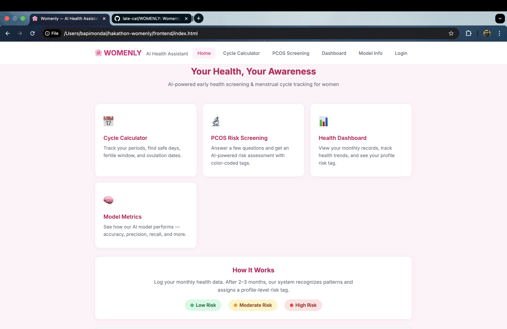
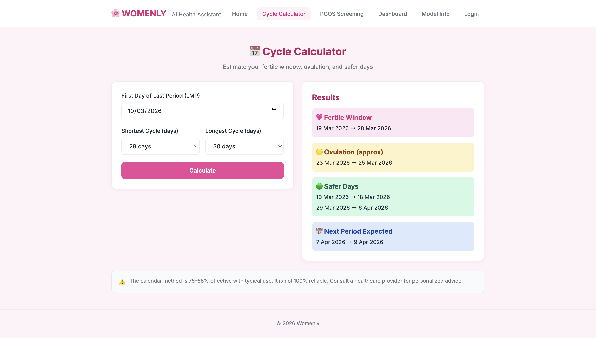

# 🌸 Womenly

Womenly is an AI-enabled menstrual health and early PCOS risk detection platform designed to make reproductive health support more private, accessible, and actionable.

A step beyond traditional fertility calculators.

## 🌍 Our Vision: Because every woman deserves access to care!

Many women still hesitate to seek help for reproductive health due to stigma, low awareness, limited access to specialists, and financial challenges, especially in underprivileged communities.

Womenly is built to bridge this gap. It provides a simple, private, and accessible space where women can track their health, stay aware, and feel supported, even without regular access to medical care.

Aligned with AI-based early disease detection, Womenly analyzes user inputs to provide early risk indications for conditions like PCOS/PCOD, helping users identify potential issues before they become more serious.

Over time, it becomes a personalized support system, helping users understand whether their health is improving, stable, or needs attention.

Womenly acts as an early awareness and risk screening tool, not a substitute for professional medical diagnosis.

## Team and Links

- Team Name: Vision-X
- Live Deployment: https://womenly.onrender.com
- GitHub Repository: https://github.com/late-cat/WOMENLY
- Demo Video: https://youtu.be/YyfKNt77TY0?si=WNU-0oNR69EiTheQ
- Presentation (PPT/PDF): https://drive.google.com/drive/folders/1TZXSImqsdWX8mO5zU1vXZxDJz6mdem_Y?usp=sharing
- Presentation includes: Problem statement and solution explanation
- Presentation includes: Future scope and scalability details

## 🤷🏻‍♀️ Why Womenly Stands Out?

- Dual-mode prediction system:
	- Basic screening using symptoms and lifestyle inputs
	- Advanced screening using clinical lab values (FSH, LH, AMH, TSH, Hemoglobin)
- Inclusive accessibility design:
	- A single platform that adapts to users with or without medical reports
	- Users can start simple and move to deeper screening when data is available
- Continuous awareness approach:
	- Monthly record tracking with profile-level trend insights (improving, stable, worsening)
	- Shifts from one-time checks to long-term health monitoring
- Deployment-ready flexibility:
	- Runtime configuration for API and Firebase enables smooth integration across environments

### 👩🏻‍💻 Technical Complexity

- End-to-end multi-layer architecture:
	- Lightweight frontend (HTML, CSS, Vanilla JS)
	- FastAPI backend with structured request and response handling
	- ML pipeline covering data preprocessing, feature mapping, model training, and metrics generation
	- Firebase Authentication and Firestore for secure identity and long-term data storage
- Dual-model ML system:
	- Two RandomForest models trained on a shared dataset with different feature sets
- Robust backend behavior:
	- Handles missing model artifacts gracefully and keeps the service operational with clear fallback responses
- Explainable outputs and metrics:
	- Dedicated metrics endpoint and visualization for accuracy, precision, recall, F1 score, confusion matrix, and feature importance

### Feasibility and Scalability

- Deployment-ready on Render with environment-based port binding
- Stateless API design, straightforward to scale horizontally
- Runtime API base URL resolution in frontend for flexible hosting environments
- Model artifacts persisted under backend/model for fast startup without mandatory retraining
- Decoupled frontend and backend structure allows independent scaling in later iterations

### 👸🏻 Real-World Impact

- Enables early awareness by helping users detect risk signals and seek timely medical consultation
- Supports private self-assessment in stigma-sensitive health contexts
- Encourages continuous monitoring through monthly records and clear trend visibility
- Improves accessibility for underserved communities with limited or delayed access to specialists

## Product Features

### 1) Cycle Calculator

Computes:

- Fertile window
- Approximate ovulation range
- Safer days
- Expected next period window

Method:

Uses standard rhythm calculations based on the last menstrual period (LMP) and the user's shortest and longest cycle lengths.

### 2) Dual-Mode PCOS Screening

- Basic screening: based on symptoms and lifestyle factors
- Advanced screening: includes symptoms along with blood test markers

Response includes:

- Risk level (low, moderate, high)
- Risk score (percentage)
- Visual tag (green, yellow, red)
- Doctor-oriented recommendation summary

### 3) Results Experience

- Displays risk level with clear score visualization
- Provides doctor-oriented recommendation summary
- Shows user-submitted inputs in a simple, readable format
- Allows logged-in users to save their records
- Indicates health trend (improving or worsening) based on results

### 4) Auth, Persistence, and Dashboard

- Google authentication via Firebase
- Record storage in Firestore under user profile
- Dashboard with history table, profile-level risk summary, and trend direction (improving/stable/worsening)
- Local fallback behavior for record visibility when cloud write/read is interrupted

### 5) Model Metrics View

- Reads backend metrics endpoint
- Displays confusion matrix and feature importances
- Handles unavailable model state gracefully in UI

## Architecture Overview

### Frontend

- Pages: home, calculator, screening, results, dashboard, metrics, login
- Stack: HTML, CSS, Vanilla JS, Chart.js
- Runtime config:
	- API URL can be injected via window.__WOMENLY_API_URL__
	- Firebase config can be injected via window.__WOMENLY_FIREBASE_CONFIG__

### Backend (FastAPI)

Core endpoints:

- GET /
- GET /health
- POST /predict
- POST /predict-advanced
- GET /metrics
- GET /js/firebase-config.local.js

Backend behavior:

- Loads model_basic.pkl, model_advanced.pkl, and metrics.json on startup
- Mounts frontend static files at root when present
- Uses ENV and PORT environment variables for development and production runtime control

### Machine Learning Pipeline

Training script: machine_learning/train_model.py

Pipeline responsibilities:

- Read and clean dataset
- Normalize feature names
- Build two feature sets (basic and advanced)
- Train two RandomForestClassifier models
- Evaluate with accuracy, precision, recall, F1, and confusion matrix
- Save model artifacts and metrics into backend/model

## Current Model Snapshot

From backend/model/metrics.json:

- Basic model:
	- Accuracy: 99.00%
	- F1: 98.39%
- Advanced model:
	- Accuracy: 99.25%
	- Precision: 99.17%
	- Recall: 98.36%
	- F1: 98.77%

Note: these metrics are from the included training artifact and may vary if retrained with updated data.

## Tech Stack

- Frontend: HTML, CSS, Vanilla JavaScript, Chart.js
- Backend: FastAPI, Uvicorn, Pydantic, NumPy, Joblib
- Machine Learning: pandas, scikit-learn, RandomForestClassifier
- Authentication and Database: Firebase Authentication, Cloud Firestore

## Project Structure

```text
hakathon-womenly/
├── README.md
├── requirements.txt
├── backend/
│   ├── app.py
│   ├── requirements.txt
│   └── model/
│       ├── metrics.json
│       ├── model_basic.pkl
│       └── model_advanced.pkl
├── machine_learning/
│   ├── dataset.csv
│   └── train_model.py
├── frontend/
│   ├── index.html
│   ├── calculator.html
│   ├── screening.html
│   ├── results.html
│   ├── dashboard.html
│   ├── metrics.html
│   ├── login.html
│   ├── css/
│   │   └── style.css
│   └── js/
│       ├── auth.js
│       ├── calculator.js
│       ├── config.js
│       ├── dashboard.js
│       ├── firebase-config.js
│       ├── metrics.js
│       ├── results.js
│       └── screening.js
└── docs/
		└── screenshots/
```

## UI Preview




## Local Setup

### 1) Clone and enter

```bash
git clone https://github.com/late-cat/WOMENLY.git
cd hakathon-womenly
```

### 2) Create and activate virtual environment

```bash
python3 -m venv .venv
source .venv/bin/activate
```

### 3) Install dependencies

```bash
pip install -r requirements.txt
```

### 4) Run backend

```bash
cd backend
python app.py
```

Backend URL: http://localhost:8000

### 5) Run frontend separately (optional)

```bash
cd frontend
python3 -m http.server 5500
```

Frontend URL: http://localhost:5500

## Firebase Setup

Womenly supports two configuration patterns:

- Direct file configuration in frontend/js/firebase-config.js
- Runtime injection by defining window.__WOMENLY_FIREBASE_CONFIG__ before Firebase initialization

Without valid Firebase config:

- Google login will not work
- Dashboard cloud history will not load or save

## Deployment Notes (Render)

- App supports Render-style PORT binding
- Static frontend is mounted by FastAPI at /
- Keep backend/model artifacts available in the deployment image, or run training during build
- Set ENV=development only for local-style hot reload behavior
- On Render free tier, the first request after inactivity may take some time due to cold starts. Please wait for the app to wake up.

Live URL: https://womenly.onrender.com

## Limitations

- Not a clinical diagnostic tool
- Output quality depends on dataset quality and representativeness
- Full authenticated experience requires internet and Firebase setup
- No multilingual UI yet

## Future Roadmap

- Multilingual and low-literacy UX support
- Better explainability layer for risk factors
- Role-based clinician review interface
- Stronger offline-first and sync-resilience behavior
- Expanded datasets for broader population generalization

---

Built by Vision-X for practical, privacy-aware women's health awareness.
